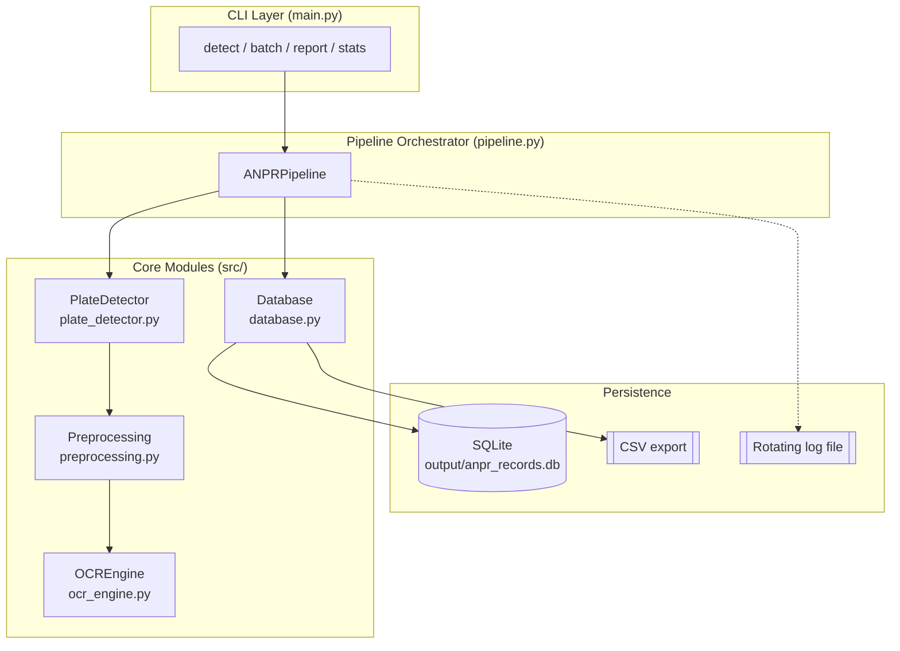
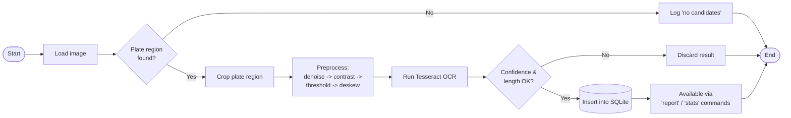
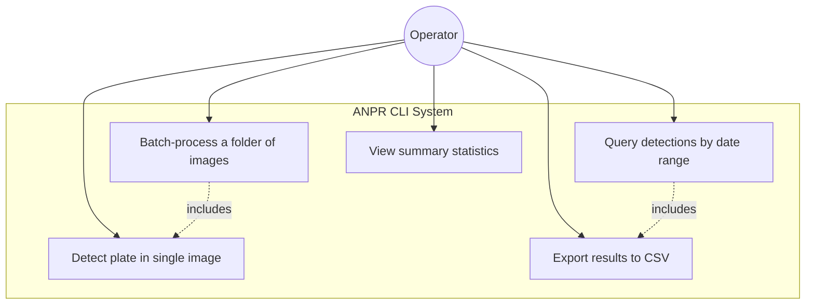
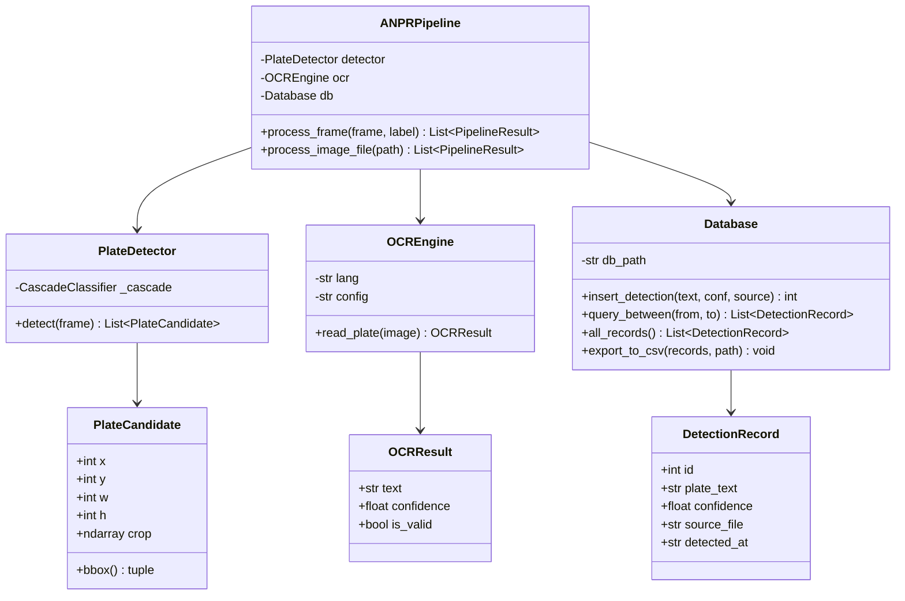
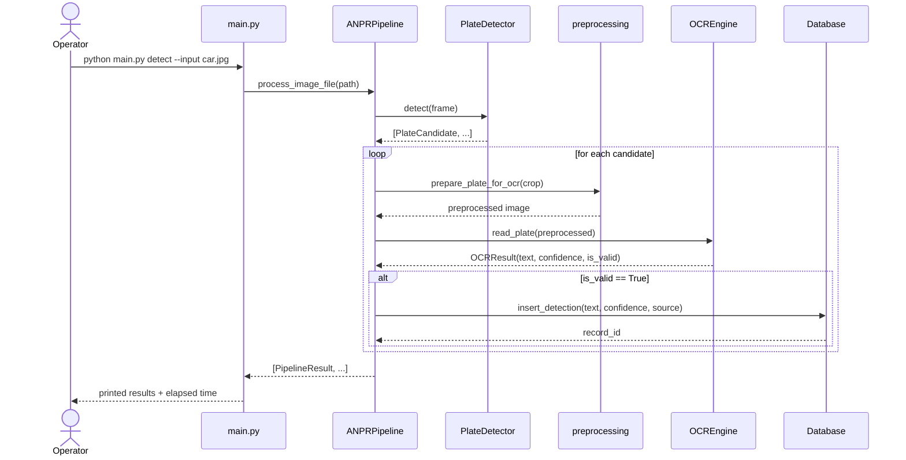
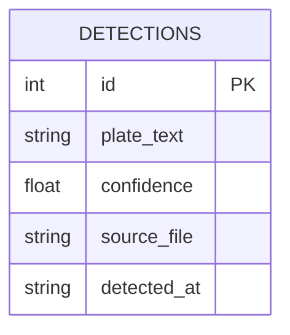

# Design Documentation

This document contains the design artefacts required by the course's
"Build Your Own Project" submission: functional/non-functional
requirements, architecture, workflow, UML diagrams, database design,
dataset description, model rationale, and evaluation methodology.

All diagrams are written in [Mermaid](https://mermaid.js.org/) syntax,
which GitHub renders natively when viewing this file in the repository.

---

## 1. Functional Requirements

| # | Requirement |
|---|-------------|
| FR1 | The system shall accept a single image file or a directory of image files as input. |
| FR2 | The system shall detect candidate license-plate regions within each image. |
| FR3 | The system shall extract and clean the plate text from each detected region using OCR. |
| FR4 | The system shall reject OCR results below a configurable confidence/length threshold. |
| FR5 | The system shall persist every valid detection (plate text, confidence, source file, timestamp) to a local database. |
| FR6 | The system shall allow querying stored detections within a given date range. |
| FR7 | The system shall allow exporting query results (and full batch results) to CSV. |
| FR8 | The system shall report summary statistics (total detections, average confidence, most recent detection). |

## 2. Non-Functional Requirements

| # | Category | Requirement |
|---|----------|-------------|
| NFR1 | **Performance** | A single-image detection + OCR cycle shall complete in under 1 second on a standard laptop CPU (measured and printed by the `detect` command). |
| NFR2 | **Reliability** | Low-confidence OCR results are flagged and excluded from storage rather than silently accepted as correct. |
| NFR3 | **Maintainability** | All tunable parameters (thresholds, paths, OCR config) live in a single `config.py` module; each pipeline stage is an independently testable module. |
| NFR4 | **Scalability** | The `batch` command processes an arbitrary number of images from a directory without code changes. |
| NFR5 | **Logging/Monitoring** | Every pipeline run writes structured, timestamped logs to a rotating log file (`logs/anpr_system.log`), capped at 1 MB per file with 3 backups. |
| NFR6 | **Resource Efficiency** | Log files rotate automatically; the database is a single lightweight SQLite file requiring no external server. |
| NFR7 | **Usability** | All functionality is reachable through a small set of self-documenting CLI subcommands (`detect`, `batch`, `report`, `stats`), each with `--help` text via `argparse`. |

---

## 3. System Architecture



**Design notes:**
- The CLI layer only parses arguments and prints results — it holds no
  business logic, so the pipeline can be reused (e.g. by a future web
  wrapper) without change.
- `ANPRPipeline` is the single coordination point between detection,
  preprocessing, OCR, and storage, keeping each module independently
  testable (see `tests/`).

## 4. Process / Workflow Diagram



## 5. Use Case Diagram



## 6. Class / Component Diagram



## 7. Sequence Diagram — `detect` command



## 8. Database / Storage Design

### ER Diagram



### Schema

```sql
CREATE TABLE IF NOT EXISTS detections (
    id              INTEGER PRIMARY KEY AUTOINCREMENT,
    plate_text      TEXT NOT NULL,
    confidence      REAL NOT NULL,
    source_file     TEXT NOT NULL,
    detected_at     TEXT NOT NULL
);
```

A single flat table is sufficient here: each row is one independent
detection event, with no relationships to other entities needed at
this scope.

---

## 9. Dataset Description

- The pipeline is designed to work on **any front/rear vehicle
  photograph with a visible plate**; it does not require a training
  dataset because it uses a pretrained Haar Cascade (see rationale
  below) rather than training a custom detector.
- `data/sample_images/` ships with one synthetically generated demo
  image (a plain background with a rendered plate) purely so the
  pipeline is runnable out of the box for grading, without depending
  on a downloaded external dataset.
- **For a fuller evaluation**, a small set (20-40 images) of real
  vehicle photos taken from different angles, lighting conditions, and
  distances should be added to `data/sample_images/` — this is the
  recommended next step described in `README.md`.
- Publicly available options for expanding the test set include
  Kaggle's "Car License Plate Detection" dataset, which provides
  labelled bounding boxes for benchmarking detection accuracy.

## 10. Model Selection Rationale

| Option considered | Decision |
|---|---|
| **Haar Cascade (`haarcascade_russian_plate_number.xml`)** | **Chosen.** Ships directly with OpenCV — no download, no training, no GPU required, and fast enough for CPU-only, real-time-ish CLI use. Well suited to a course project scoped around applying CV concepts (Haar features, sliding-window multi-scale detection) rather than deep-learning infrastructure. |
| YOLOv5/v8 plate detector | Rejected for this scope — requires a pretrained weights file or a labelled dataset to fine-tune, adds heavy dependencies (PyTorch), and is harder to justify as "CPU, CLI-only, no external downloads." A natural future enhancement (see README). |
| Pure contour/edge-based detection (no ML) | Rejected — far more sensitive to background clutter and lighting; produces many false positives on non-plate rectangular regions. |

For OCR, **Tesseract** was chosen over a custom-trained CNN classifier
because it is a mature, widely used, dependency-light OCR engine that
performs reliably on printed alphanumeric text once given a
well-preprocessed crop — exactly what the preprocessing chain in
`src/preprocessing.py` is designed to produce.

## 11. Evaluation Methodology

Two complementary levels of evaluation are used:

1. **Unit-level correctness** (automated, `tests/`): each module
   (preprocessing, detector, OCR, database) is tested in isolation
   with synthetic inputs, so a regression in one module is caught
   without needing a full image dataset.
2. **End-to-end pipeline evaluation** (manual, on real images): for a
   given test set of N images with known ground-truth plate numbers,
   compute:
   - **Detection rate** = (images where a plate region was found) / N
   - **Recognition accuracy** = (images where OCR text exactly matches
     ground truth) / (images where a plate region was found)
   - **Average processing time per image**, printed by the CLI itself

This two-level approach separates "does the code behave correctly"
(unit tests, always reproducible) from "how good is the model on real
photos" (dataset-dependent, reported in the project report with
whatever sample images are available at submission time).

## 12. Known Limitations & Future Enhancements

- Haar Cascade detection is sensitive to plate angle and lighting;
  heavily skewed or partially obscured plates may not be detected.
- Only single-line plate formats are supported by the current OCR
  configuration (`--psm 7`).
- No support for non-Latin scripts.
- Future work: swap in a YOLO-based detector for higher recall, add a
  confidence-weighted ensemble of multiple OCR passes, and add a
  lightweight web dashboard on top of the existing `Database` module.
